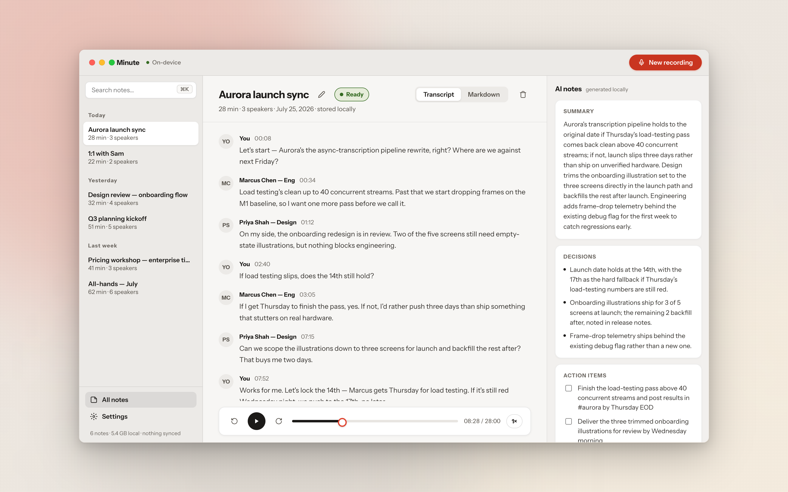
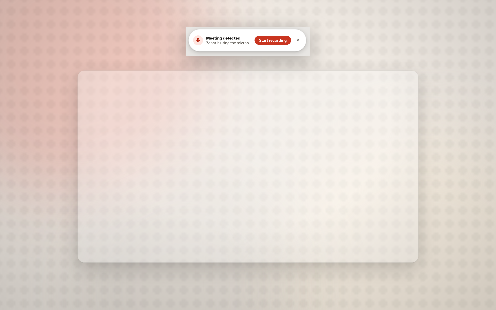
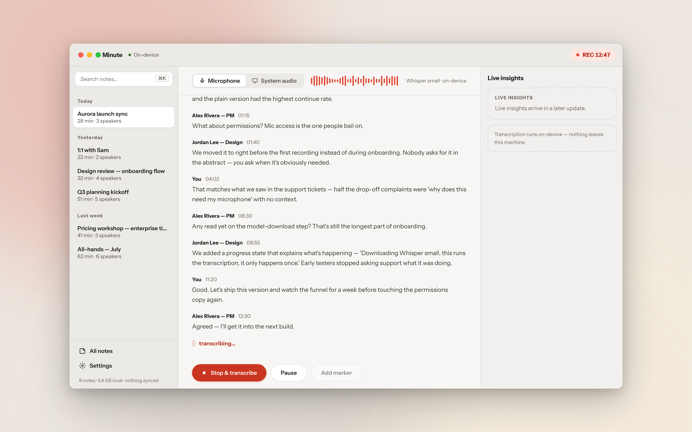
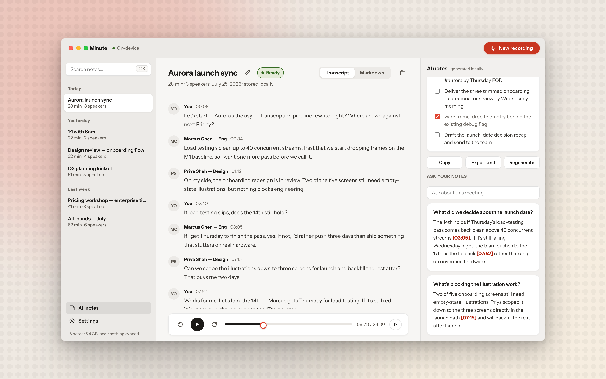
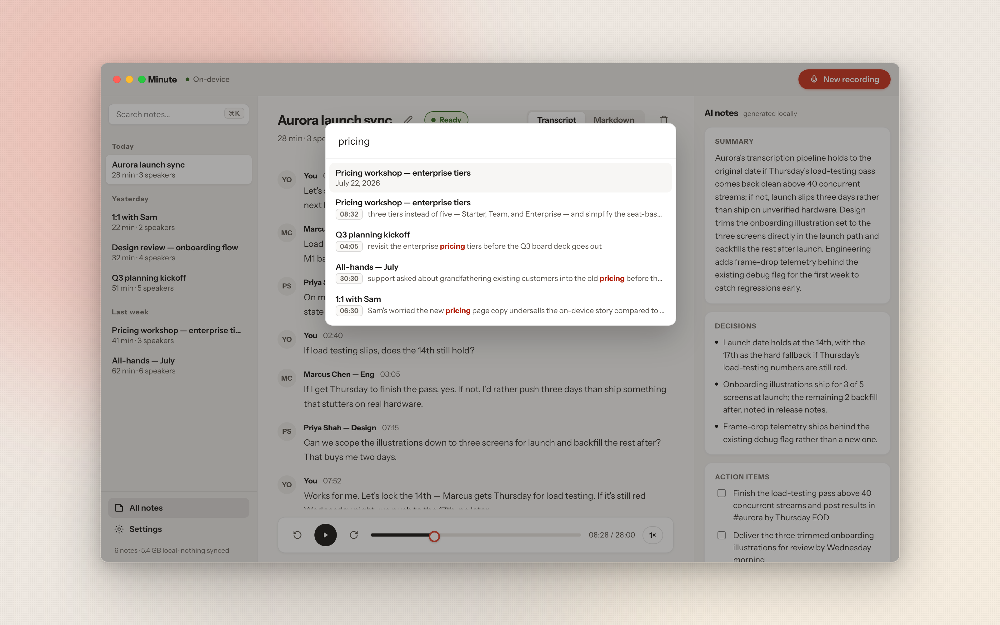
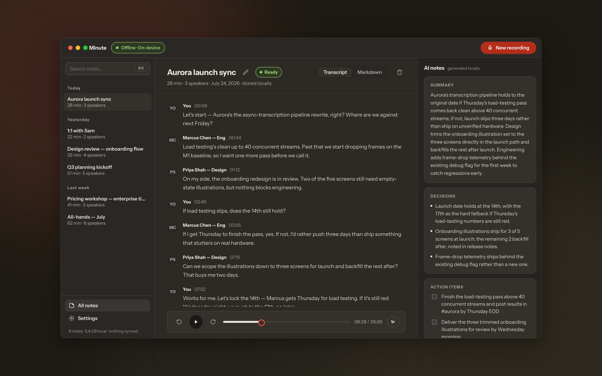
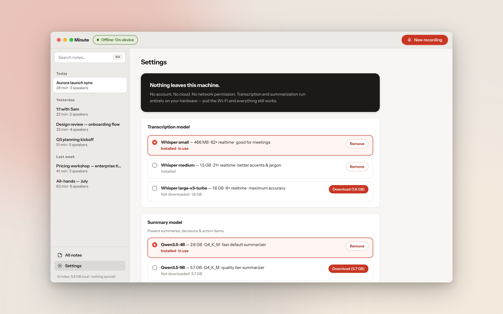

<div align="center">

# Minute

**Meeting notes that never leave your Mac.**




</div>

Minute is a fully offline meeting notetaker for macOS. It records audio,
transcribes it live with Whisper, and turns the transcript into a summary,
decisions, and action items with a local LLM — all of it running on-device,
in-process, with Metal acceleration. No account, no cloud, no server. The
only network traffic Minute ever makes is an optional model download the
first time you pick a bigger model.

## Why

Most meeting notetakers are a microphone hooked up to somebody else's
server. Minute is a notebook: it writes to a folder on your disk, in plain
text and WAV, and asks nothing of the network to work. Turn off Wi-Fi and
record a meeting — it transcribes, summarizes, and answers questions about
it exactly the same as it does online, because it never used the network in
the first place.

## Meeting detection, without a permission prompt

When another app starts using your microphone — Zoom, Teams, Webex, Slack,
FaceTime, Discord, or a browser call — Minute notices and offers a quiet
pill above whatever you're looking at: one click starts recording, one
click (or 12 seconds of silence) dismisses it. It's off by default; turn
it on in Settings.

This is the honest version of what that pill is doing: it checks whether
the default microphone is in use and which apps are currently running —
both things any app on the system can already see, neither one requiring
a permission dialog. It never opens the microphone itself and never
listens to audio to decide whether to show up. Turn the toggle off and
the detector thread stops existing, not just stops firing.



## Recording, transcribed as it happens

Hit record and Whisper starts transcribing in real time, grouped by speaker,
scrolling live as the meeting runs. Pause and resume freely; nothing is sent
anywhere while you do.

Turn on **Capture system audio** in Settings and a recording captures both
sides of the call — your microphone and what your Mac is playing — so the
other participants land in the transcript too, not just you. It needs
macOS 13 or later and Screen Recording permission (the one system prompt
this whole feature ever triggers); say no, or run an older macOS, and
recording still works exactly as before, mic-only. One caveat worth
knowing: if you're on speakers rather than headphones, your own voice can
get picked up twice — once by the mic, once by the system-audio stream
playing it back out — there's no echo cancellation between the two yet.



## A summary you can act on

Once a note is transcribed, a local LLM turns it into a short summary,
a list of decisions, and action items you can check off without leaving the
note. Every field is generated on your machine, from your transcript, and
regenerates on demand if the meeting gets edited or re-run.

## Ask your notes, with receipts

Ask a plain-language question about a meeting — "what did we decide about
the launch date?" — and Minute answers from the transcript, with inline
`[mm:ss]` citations you can click to jump straight to that moment in the
recording. It's a conversation with your own notes, not a chatbot guessing
from a summary.



## Find anything, instantly

⌘K searches titles and full transcript text across your whole library,
with matches highlighted and playback ready to seek straight to the moment
someone said the thing you're looking for.



## Dark mode that still feels like paper

Minute follows macOS's appearance setting. The dark theme isn't an inverted
light theme — it's its own warm, ink-on-dark-paper palette, built to the
same calm, analog feel as the light one.



## Models sized to your Mac

Whisper (small / medium / large-v3-turbo) for transcription and a choice of
local LLMs (Qwen3.5-4B, Qwen3.5-9B, Gemma 4 E4B) for summarization — pick
what fits your hardware and disk budget, or let Minute suggest a pair based
on your RAM and chip. Everything downloads once, runs entirely offline
after that, and can be removed just as easily.



## How it works

Minute is a [Tauri 2](https://tauri.app) app: a React 19 + TypeScript
frontend around a Rust backend that runs [whisper.cpp](https://github.com/ggml-org/whisper.cpp)
and [llama.cpp](https://github.com/ggml-org/llama.cpp) in-process, with
Metal acceleration on Apple Silicon — no sidecar process, no local server,
no localhost port. The frontend talks to the backend over Tauri's IPC; the
backend talks to whisper.cpp/llama.cpp as linked libraries.

Each note is a plain folder on disk, human-readable and yours regardless of
whether Minute is still installed:

```
~/Library/Application Support/dev.minute.app/notes/<note-id>/
├── audio.wav         # the recording (deleted automatically after 30 days, if enabled)
├── transcript.json   # timestamped, speaker-labeled segments
├── summary.json      # summary, decisions, action items
└── note.md           # everything above, rendered as one Markdown file
```

Models live alongside them, in a shared `models/` directory, downloaded once
and reused across every note. `hardware_info` reads your Mac's RAM and chip
to recommend a Whisper + LLM pair that fits comfortably — nothing is forced,
every model in the catalog stays choosable, download size and RAM
requirements shown up front.

## Privacy

**Nothing leaves this machine.** Concretely, not as a slogan:

- Minute's [CSP](src-tauri/tauri.conf.json) has no network origin at all —
  `default-src 'self'`, no exceptions. The only asset-loading rule is the
  Tauri asset protocol serving your own note audio back to the player.
- Fonts (Instrument Sans) ship bundled in the app, not fetched from Google
  Fonts or any other CDN.
- Transcription and summarization run as linked libraries in the same
  process as the app itself — there is no local server, no localhost port,
  nothing to inspect in a network tab, because there's no network activity
  to inspect.
- Turn off Wi-Fi before a meeting. Record, transcribe, summarize, ask
  questions about it. Nothing about that flow behaves any differently
  offline, because it's never anything but offline — except downloading a
  new model, which is the one deliberate exception and always your choice.

## Requirements

- Apple Silicon Mac (M1 or later)
- macOS 11 or later (macOS 13 or later for system-audio capture; everything
  else works down to 11)
- ~3 GB of free disk space for the default Whisper small + Qwen3.5-4B pair

## Install

Minute isn't notarized or distributed as a signed build yet — build it from
source:

```bash
git clone https://github.com/<you>/local-transcription-app.git
cd local-transcription-app
npm install
npm run tauri build
```

This produces a `.app` (and a `.dmg`) under `src-tauri/target/release/bundle/`.
On first launch, Minute walks you through picking and downloading a
transcription + summary model pair sized to your hardware — that's the only
thing that touches the network, ever.

## Development

```bash
npm install
npm run tauri dev   # run the app with hot reload
npm test            # frontend tests (vitest)
npm run test:rust   # Rust backend tests (cargo test)
npx tsc -b           # type-check
npm run lint         # oxlint
```

## Roadmap

Honestly, in rough priority order:

- **Speaker diarization and naming** — segments are currently labeled
  `Speaker 1`, `Speaker 2`, … with no way to assign real names.
- **Cross-note ask** — ask-your-notes currently answers from one note's
  transcript at a time; asking across your whole library is the natural
  next step.
- **More models** — the catalog grows as good on-device options do; nothing
  about the architecture is tied to the current lineup.
- **Calendar-aware nudges** — meeting detection currently reacts to the mic
  going hot in a known app; reading your calendar to know a meeting's name
  and attendees ahead of time is scoped but parked for a later release.
- **Per-app audio taps** — system audio currently captures the whole
  machine's output; Apple's newer CATap API would let capture target a
  single app's audio instead, once it's broadly available to build against.
- **Signed, notarized releases** — so `npm run tauri build` from source
  isn't the only way to install it.

## License

[MIT](LICENSE). The bundled `llama-cpp-2` sources in `src-tauri/vendor/` retain their upstream MIT/Apache-2.0 licensing; model weights downloaded in-app carry their own licenses (Whisper: MIT; Qwen: Apache-2.0; Gemma: Gemma Terms of Use).
