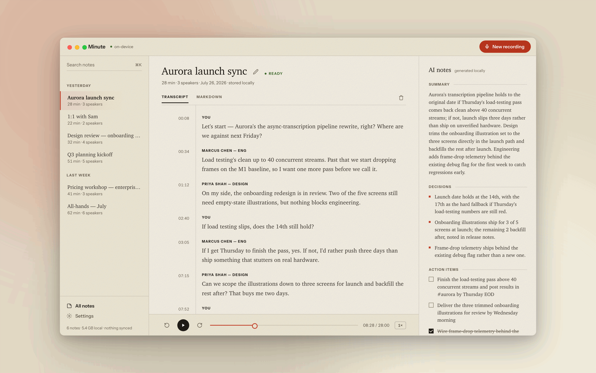
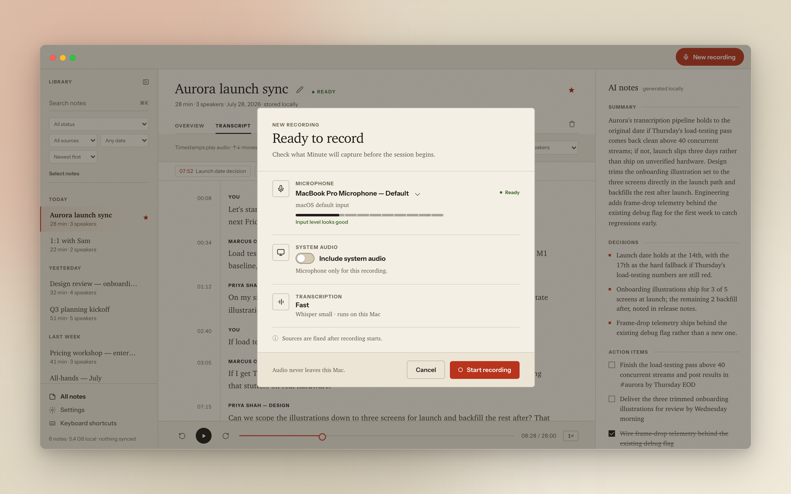
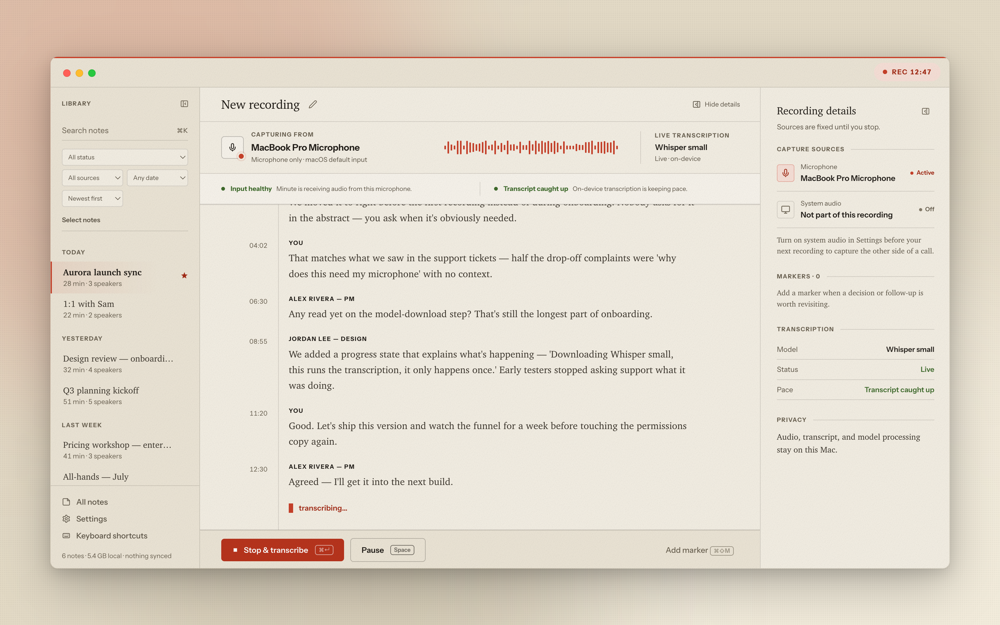
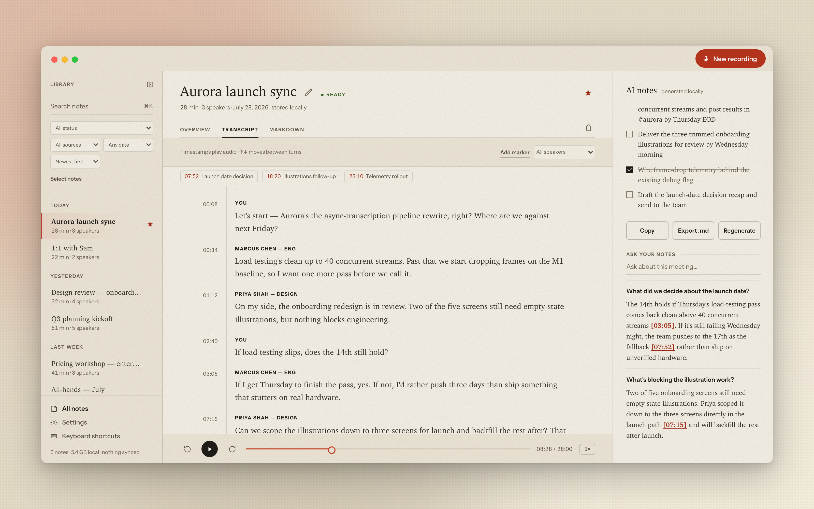
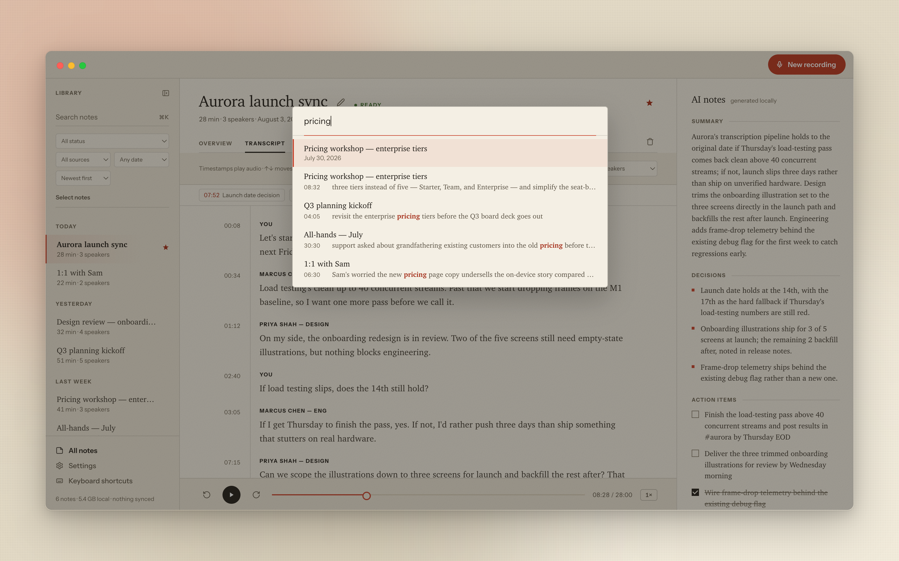
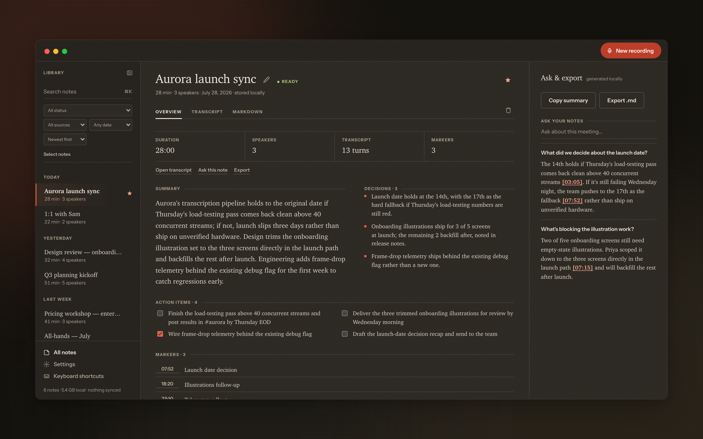
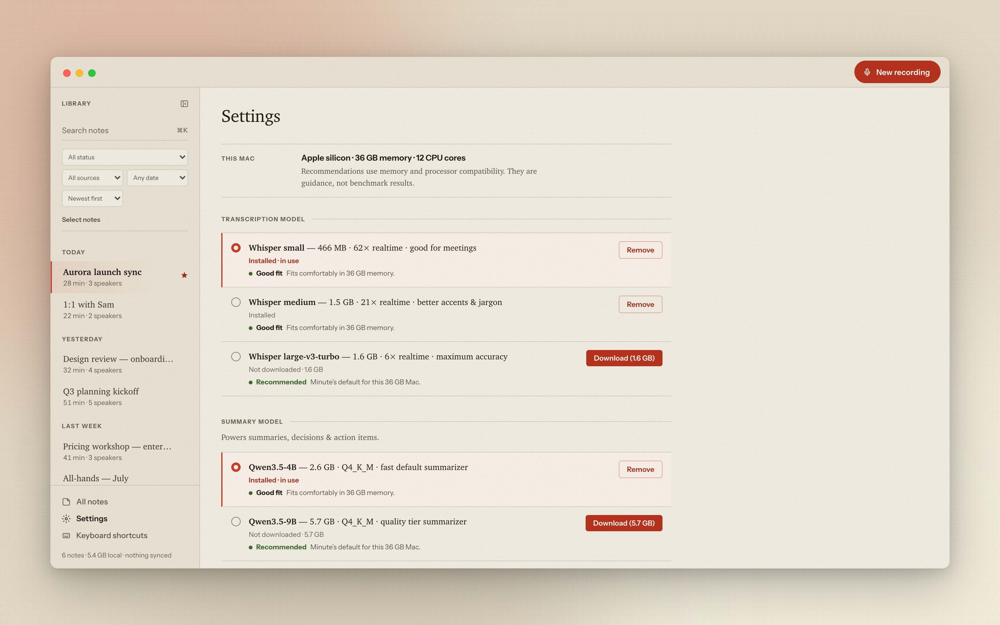

<div align="center">

# Minute

**Meeting notes that never leave your Mac.**




**[⬇ Download the current private build for Apple Silicon](https://github.com/mraza007/minute/releases/download/private-v0.6.0-20260728/Minute-aarch64-apple-darwin-private.zip)**

Using an Intel Mac? [Download the Intel private build](https://github.com/mraza007/minute/releases/download/private-v0.6.0-20260728/Minute-x86_64-apple-darwin-private.zip).

Current downloads are ad-hoc signed and are not notarized. After copying
Minute to Applications, try opening it once, then use **System Settings →
Privacy & Security → Open Anyway**. See
[Installing a private build](#installing-a-private-build) for the complete,
safer Gatekeeper process.

</div>

Minute is a fully offline meeting notetaker for macOS. It records audio,
transcribes it live with Whisper, and turns the transcript into a summary,
decisions, and action items with a local LLM — all of it running on-device,
in-process, with Metal acceleration. No account, no cloud, no server. The
only network traffic Minute ever makes is an optional model download the
first time you pick a bigger model.

## Why

Most meeting notetakers are a microphone hooked up to somebody else's
server. Minute is a notebook: it writes to a folder on your disk, in plain
text and WAV, and asks nothing of the network to work. Turn off Wi-Fi and
record a meeting — it transcribes, summarizes, and answers questions about
it exactly the same as it does online, because it never used the network in
the first place.

## Meeting detection, without a permission prompt

When another app starts using your microphone — Zoom, Teams, Webex, Slack,
FaceTime, Discord, or a browser call — Minute notices and offers a quiet
pill above whatever you're looking at: one click starts recording, one
click (or 12 seconds of silence) dismisses it. It's off by default; turn
it on in Settings.

This is the honest version of what that pill is doing: it checks whether
the default microphone is in use and which apps are currently running —
both things any app on the system can already see, neither one requiring
a permission dialog. It never opens the microphone itself and never
listens to audio to decide whether to show up. Turn the toggle off and
the detector thread stops existing, not just stops firing.


## Recording, transcribed as it happens

Before recording, Minute shows exactly what it will capture: the real current
microphone, a live input meter, system-audio availability, and a transcription
mode with an honest fit label for this Mac. Capture sources stay visible
throughout the meeting, so there is never any ambiguity about where the input
is coming from.



Once recording starts, Whisper transcribes in real time, grouped by speaker
and scrolling live as the meeting runs. Rename the working title, pause and
resume, or add timestamped markers with `⌘⇧M`. Minute calls out prolonged
silence, clipping, a disconnected input, or transcription lag without hiding
the audio capture that is still safe.

Turn on **Capture system audio** in Settings and a recording captures both
sides of the call — your microphone and what your Mac is playing — so the
other participants land in the transcript too, not just you. It needs
macOS 13 or later and Screen Recording permission (the one system prompt
this whole feature ever triggers); say no, or run an older macOS, and
recording still works exactly as before, mic-only. One caveat worth
knowing: if you're on speakers rather than headphones, your own voice can
get picked up twice — once by the mic, once by the system-audio stream
playing it back out — there's no echo cancellation between the two yet.



## A summary you can act on

Once a note is transcribed, a local LLM turns it into a short summary,
a list of decisions, and action items you can check off without leaving the
note. The post-recording overview keeps source, duration, speakers, transcript
turns, and markers together. Every generated field comes from the local
transcript and can be regenerated without uploading the meeting.

## Ask your notes, with receipts

Ask a plain-language question about a meeting — "what did we decide about
the launch date?" — and Minute answers from the transcript, with inline
`[mm:ss]` citations you can click to jump straight to that moment in the
recording. It's a conversation with your own notes, not a chatbot guessing
from a summary.



## Find anything, instantly

⌘K searches titles and full transcript text across your whole library,
with matches highlighted and playback ready to seek straight to the moment
someone said the thing you're looking for.

For larger libraries, notes can be pinned, filtered by recording status,
source, or date, and sorted by newest, oldest, duration, or title. Multi-select
supports bulk export and recoverable deletion, while per-note storage details
make audio retention visible instead of mysterious.



## Clean up without losing work

Rename speakers, filter the transcript by speaker, or merge duplicate speaker
identities with an exact undo path. Confirmed names are remembered when Minute
has reliable matching data. Markers remain editable after recording, deleted
notes move into local recovery, and destructive cleanup always offers Undo.

## Dark mode that still feels like paper

Minute follows macOS's appearance setting. The dark theme isn't an inverted
light theme — it's its own warm, ink-on-dark-paper palette, built to the
same calm, analog feel as the light one.



## Models sized to your Mac

Whisper (small / medium / large-v3-turbo) for transcription and a choice of
local LLMs (Qwen3.5-4B, Qwen3.5-9B, Gemma 4 E4B) for summarization — pick
what fits your hardware and disk budget, or let Minute suggest a pair based
on the detected architecture, memory, and CPU cores. Every choice is labeled
**Recommended**, **Good fit**, **Near memory limit**, **Below minimum**, or
**Not supported** without pretending to have benchmarked hardware it has not.
Everything downloads once, runs entirely offline after that, and can be
removed just as easily.



## How it works

Minute is a [Tauri 2](https://tauri.app) app: a React 19 + TypeScript
frontend around a Rust backend that runs [whisper.cpp](https://github.com/ggml-org/whisper.cpp)
and [llama.cpp](https://github.com/ggml-org/llama.cpp) in-process, with
Metal acceleration on Apple Silicon — no sidecar process, no local server,
no localhost port. The frontend talks to the backend over Tauri's IPC; the
backend talks to whisper.cpp/llama.cpp as linked libraries.

Each note is a plain folder on disk, human-readable and yours regardless of
whether Minute is still installed:

```
~/Library/Application Support/dev.minute.app/notes/<note-id>/
├── audio.wav         # the recording (deleted automatically after 30 days, if enabled)
├── transcript.json   # timestamped, speaker-labeled segments
├── summary.json      # summary, decisions, action items
└── note.md           # everything above, rendered as one Markdown file
```

Models live alongside them, in a shared `models/` directory, downloaded once
and reused across every note. `hardware_info` reads your Mac's RAM and chip
to recommend a Whisper + LLM pair that fits comfortably — nothing is forced,
every model in the catalog stays choosable, download size and RAM
requirements shown up front.

## Privacy

**Nothing leaves this machine.** Concretely, not as a slogan:

- Minute's [CSP](src-tauri/tauri.conf.json) has no network origin at all —
  `default-src 'self'`, no exceptions. The only asset-loading rule is the
  Tauri asset protocol serving your own note audio back to the player.
- Fonts (Instrument Sans) ship bundled in the app, not fetched from Google
  Fonts or any other CDN.
- Transcription and summarization run as linked libraries in the same
  process as the app itself — there is no local server, no localhost port,
  nothing to inspect in a network tab, because there's no network activity
  to inspect.
- Turn off Wi-Fi before a meeting. Record, transcribe, summarize, ask
  questions about it. Nothing about that flow behaves any differently
  offline, because it's never anything but offline — except downloading a
  new model, which is the one deliberate exception and always your choice.
- A privacy-safe diagnostics export records app, model, source, storage, and
  recovery state without including the recording or transcript.

## Requirements

- macOS 11 or later; macOS 13 or later for system-audio capture.
- Apple Silicon is the tested and recommended target. A separate Intel build
  is produced and architecture-verified, but launch and transcription on
  physical Intel hardware remain a release-validation item.
- Model availability depends on architecture and memory. Minute shows the
  compatibility result before download.
- About 3 GB of free disk space for the default Whisper small + Qwen3.5-4B
  pair, plus space for retained recordings.

## Install

Grab the architecture-appropriate ZIP from
[Installing a private build](#installing-a-private-build), or build Minute
from source:

```bash
git clone https://github.com/mraza007/minute.git
cd minute
npm ci
npm run tauri build
```

This produces a `.app` (and a `.dmg`) under `src-tauri/target/release/bundle/`.
Builds are ad-hoc signed, not notarized. On first launch, Minute walks you
through picking and downloading a transcription + summary model pair sized to
your hardware — that is the only deliberate network access in the app.

## Private macOS distribution

Minute includes a manually triggered
[Ad-hoc private macOS build](.github/workflows/private-macos-build.yml)
workflow for small, trusted beta groups when Apple Developer Program
credentials are not available. It:

- runs the full verification suite;
- builds separate Apple Silicon and Intel applications;
- verifies the main executable and every bundled dynamic library against the
  intended architecture;
- validates the ad-hoc code signature; and
- uploads a ZIP and SHA-256 checksum for each architecture.

### Producing private builds

Commit the workflow to the repository's default branch, then open **GitHub →
Actions → Ad-hoc private macOS build → Run workflow**. GitHub repository
readers can download the finished artifacts from the workflow run.

The same workflow can be started and downloaded with the GitHub CLI:

```bash
gh workflow run private-macos-build.yml --ref main
gh run list --workflow private-macos-build.yml --limit 1
gh run watch RUN_ID
gh run download RUN_ID
```

The run produces:

| Recipient Mac | Artifact |
| --- | --- |
| Apple Silicon (`uname -m` → `arm64`) | `Minute-aarch64-apple-darwin-private.zip` |
| Intel (`uname -m` → `x86_64`) | `Minute-x86_64-apple-darwin-private.zip` |

Share the matching `.zip` and `.zip.sha256` files. For stronger tamper
detection, send the checksum through a separate trusted channel. Recipients
can verify it in the download folder:

```bash
shasum -a 256 -c Minute-aarch64-apple-darwin-private.zip.sha256
```

The expected result ends in `OK`.

### Installing a private build

Download the attached build that matches your Mac:

| Mac | Private build attachment | SHA-256 checksum |
| --- | --- | --- |
| Apple Silicon (M1 or newer) | [Minute-aarch64-apple-darwin-private.zip](https://github.com/mraza007/minute/releases/download/private-v0.6.0-20260728/Minute-aarch64-apple-darwin-private.zip) | [checksum](https://github.com/mraza007/minute/releases/download/private-v0.6.0-20260728/Minute-aarch64-apple-darwin-private.zip.sha256) |
| Intel | [Minute-x86_64-apple-darwin-private.zip](https://github.com/mraza007/minute/releases/download/private-v0.6.0-20260728/Minute-x86_64-apple-darwin-private.zip) | [checksum](https://github.com/mraza007/minute/releases/download/private-v0.6.0-20260728/Minute-x86_64-apple-darwin-private.zip.sha256) |

These attachments are built from the
[`private-v0.6.0-20260728` tag](https://github.com/mraza007/minute/tree/private-v0.6.0-20260728)
by the
[private macOS build workflow](https://github.com/mraza007/minute/actions/workflows/private-macos-build.yml).
Choose **Apple menu → About This Mac** if you are unsure which processor your
Mac uses.

1. Unzip the architecture-appropriate download.
2. Drag `Minute.app` into **Applications**.
3. Try opening Minute once and dismiss the unidentified-developer warning.
4. Open **System Settings → Privacy & Security**.
5. Scroll to **Security**, click **Open Anyway**, authenticate, and confirm
   **Open**.
6. Approve Minute's microphone permission when prompted. System-audio capture
   additionally needs Screen Recording permission on macOS 13 or later.

Apple makes **Open Anyway** available for about an hour after the blocked open
attempt and then remembers the app as an exception. Only use that override for
a build received through a trusted channel. Do not disable Gatekeeper globally
or instruct recipients to strip quarantine attributes. See Apple's
[Gatekeeper installation guidance](https://support.apple.com/guide/mac-help/open-a-mac-app-from-an-unidentified-developer-mh40616/mac).

Ad-hoc distribution is intentionally limited:

- macOS identifies the build as coming from an unidentified developer;
- it cannot pass notarization, stapling, or a normal clean-Mac Gatekeeper
  assessment;
- private updates are replacement downloads for now; and
- a public, low-friction release still requires a Developer ID Application
  certificate and Apple notarization.

The complete production signing plan and the no-membership fallback are
documented in
[docs/release/SIGNING_NOTARIZATION.md](docs/release/SIGNING_NOTARIZATION.md).

## Development

```bash
npm install
npm run tauri dev   # run the app with hot reload
npm test            # frontend tests (vitest)
npm run test:rust   # Rust backend tests (cargo test)
npm run lint        # oxlint
npm run verify      # lint + frontend + build + Rust + release metadata
npm run test:soak   # multi-hour logical recording soak
npm run test:scale  # large synthetic library performance
npm run test:visual # screenshot regression suite
```

## Roadmap

Honestly, in rough priority order:

- **Real-device release matrix** — removable-microphone disconnect/reconnect,
  physical sleep/wake, constrained-volume failure, and overnight finalization.
- **Signed, notarized releases** — Developer ID, Apple notarization, stapling,
  clean-Mac Gatekeeper installation, and signed update/rollback validation.
- **Diarization quality** — speaker rename, merge, persistence, and undo are in
  place; improving the underlying automatic speaker separation remains useful.
- **Cross-note ask** — ask-your-notes currently answers from one note's
  transcript at a time; asking across your whole library is the natural
  next step.
- **More models** — the catalog grows as good on-device options do; nothing
  about the architecture is tied to the current lineup.
- **Calendar-aware nudges** — meeting detection currently reacts to the mic
  going hot in a known app; reading your calendar to know a meeting's name
  and attendees ahead of time is scoped but parked for a later release.
- **Per-app audio taps** — system audio currently captures the whole
  machine's output; Apple's newer CATap API would let capture target a
  single app's audio instead, once it's broadly available to build against.

## License

[MIT](LICENSE). The bundled `llama-cpp-2` sources in `src-tauri/vendor/` retain their upstream MIT/Apache-2.0 licensing; model weights downloaded in-app carry their own licenses (Whisper: MIT; Qwen: Apache-2.0; Gemma: Gemma Terms of Use).
